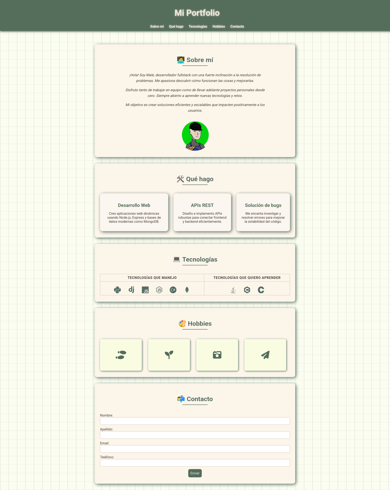
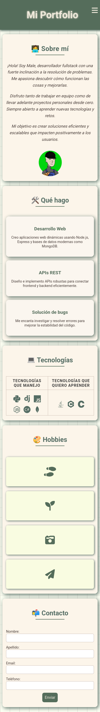

### Mi Portfolio 

Este repositorio contiene mi portfolio personal desarrollado con HTML, CSS y un pequeño script en JavaScript. El diseño sigue una estética vintage, con secciones de **Sobre mí**, **Qué hago**, **Tecnologías**, **Hobbies** y **Contacto**.  

---  


### 📁 Estructura del proyecto  
```
├── css/              # Archivos CSS
    ├── styles.css  
├── img/              # Imágenes y capturas de pantalla
│   ├── profile.png
│   ├── screenshot1.png
│   ├── screenshot2.png
│   └── screenshot3.png
├── index.html        # Página principal
└── README.md         # Documentación del proyecto
```

## 🚀 Deploy  

Visita la versión deployada en GitHub Pages: [https://malenavero.github.io/PF_1_FRONT_COMISION_E/](https://malenavero.github.io/PF_1_FRONT_COMISION_E/)

---

## 🛠 Tecnologías utilizadas  
- **HTML**  
- **CSS** (Grid, Flexbox, Media Queries)  
- **JavaScript** (menú hamburguesa)  
- **Font Awesome** (iconos)  

---

## 📐 Responsive  
Se han agregado media queries para distintos tamaños de pantalla:  
- **Tablet horizontal** (max-width: 1080px)  
- **Tablet vertical** (max-width: 768px)  
- **Móvil 1** (max-width: 480px)  
- **Móvil 2** (max-width: 375px)  

---

## 📸 Capturas de pantalla  
**Vista Web**  



**Vista Mobile**  




